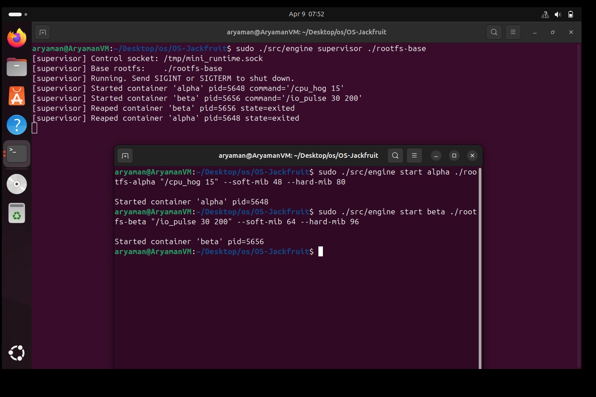
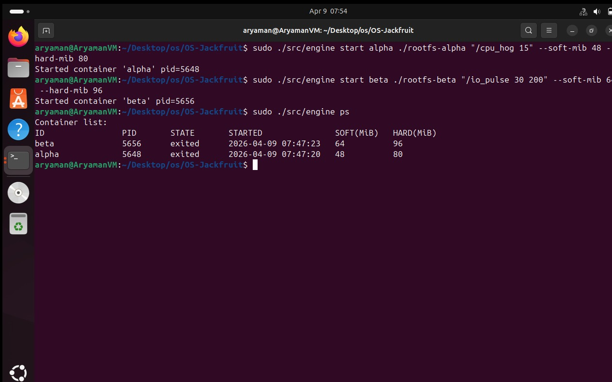
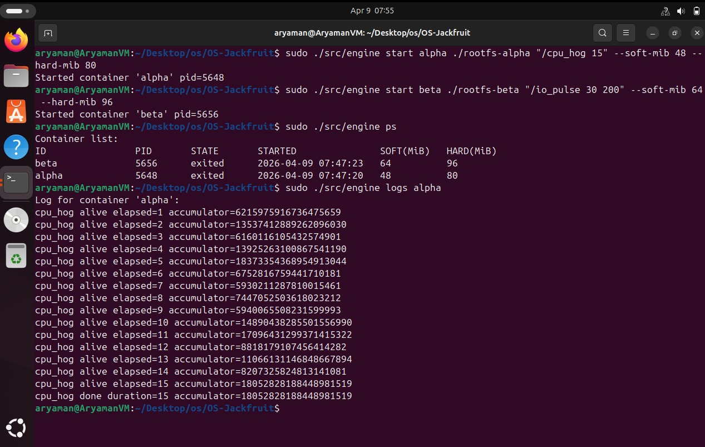
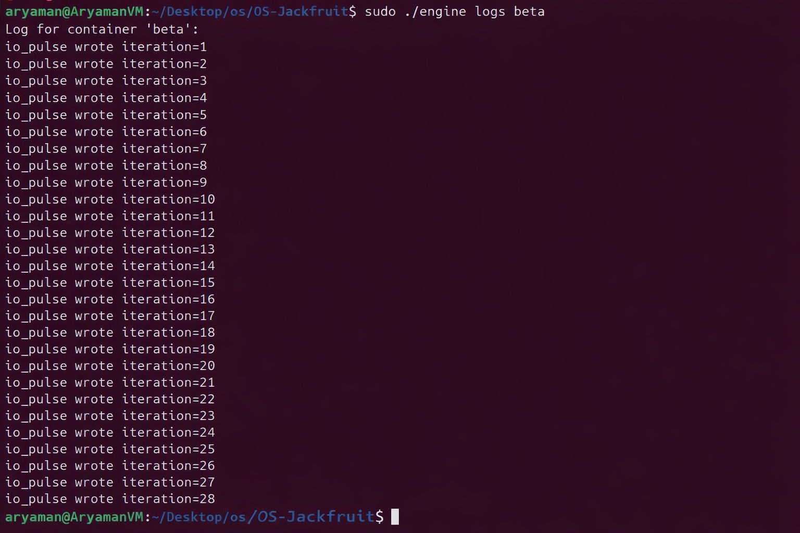
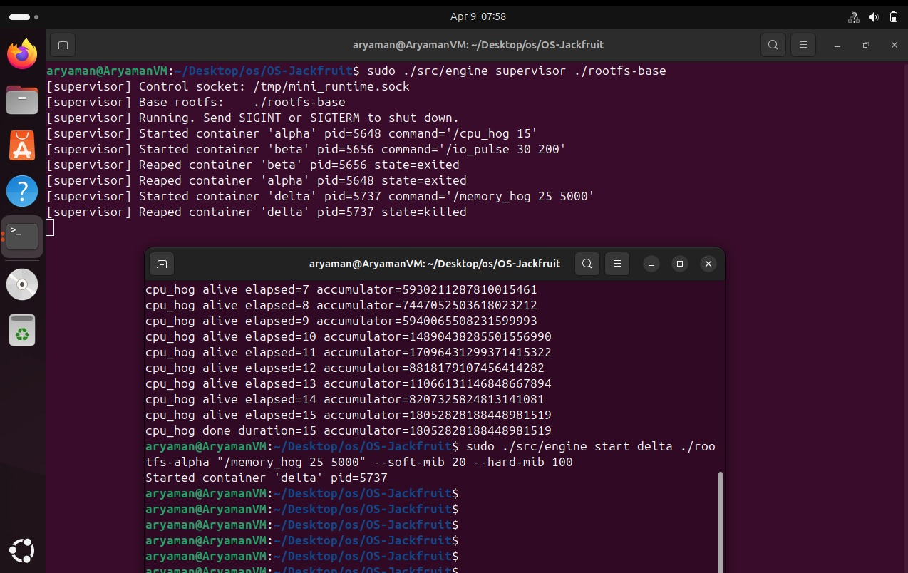
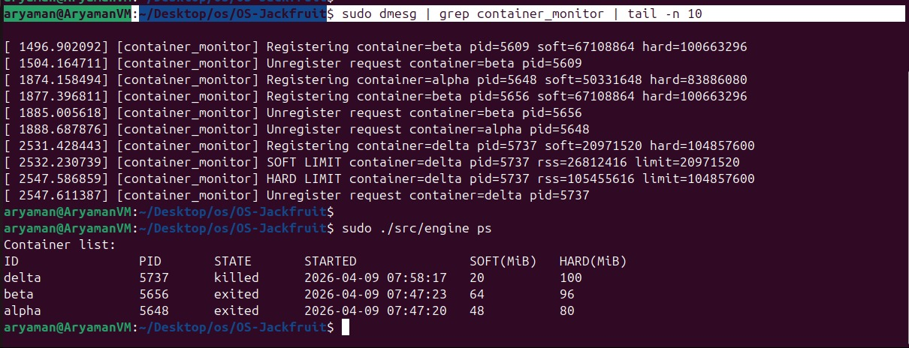
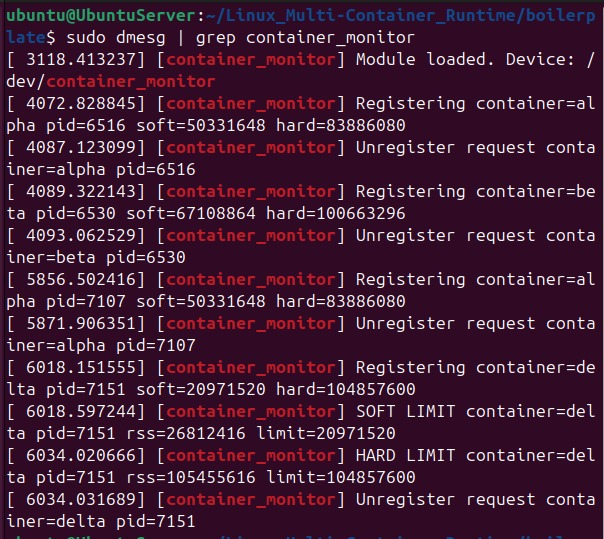
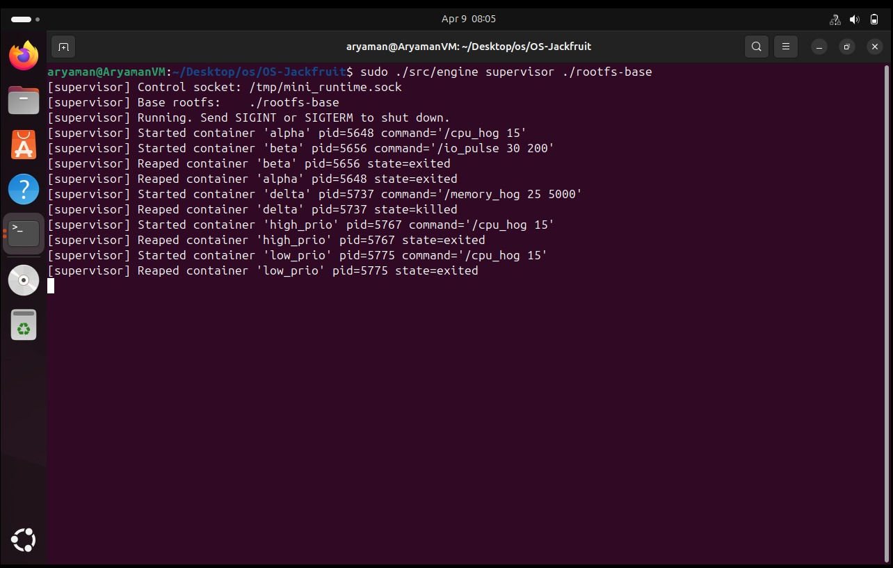
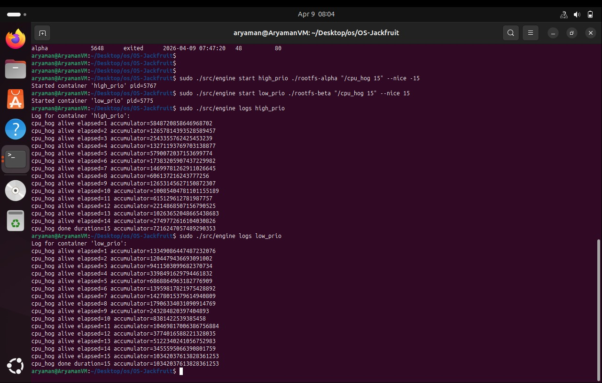
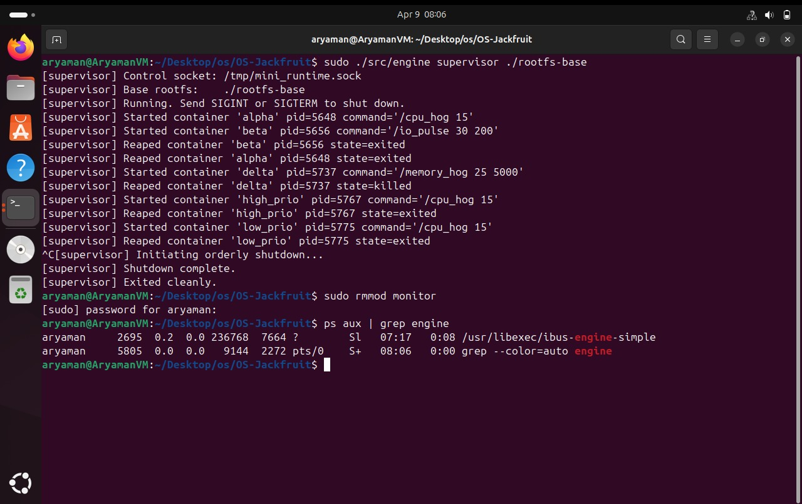

# Multi-Container Runtime

A lightweight Linux container runtime in C featuring a long-running supervisor daemon, a bounded-buffer logging pipeline, a UNIX-socket CLI, and a kernel-space memory monitor.

---

## 1. Team Information

| Name | SRN |
|------|-----|
| Anish A Kunder | PES1UG24AM343 |
| Aryaman D K | PES1UG24AM344 |

---

## 2. Build, Load, and Run Instructions

### Prerequisites

Ubuntu 22.04 or 24.04 in a VM with **Secure Boot OFF**. WSL is not supported.

```bash
sudo apt update
sudo apt install -y build-essential linux-headers-$(uname -r)
```

Run the environment preflight check:

```bash
cd src
chmod +x environment-check.sh
sudo ./environment-check.sh
```

### Prepare the Alpine Root Filesystem

```bash
mkdir rootfs-base
wget https://dl-cdn.alpinelinux.org/alpine/v3.20/releases/x86_64/alpine-minirootfs-3.20.3-x86_64.tar.gz
tar -xzf alpine-minirootfs-3.20.3-x86_64.tar.gz -C rootfs-base
```

Create one writable copy per container before launch:

```bash
cp -a ./rootfs-base ./rootfs-alpha
cp -a ./rootfs-base ./rootfs-beta
```

Do not commit `rootfs-base/` or `rootfs-*/` to the repository.

### Build

```bash
cd src
make
```

This builds: `engine`, `memory_hog`, `cpu_hog`, `io_pulse`, and `monitor.ko`.

For CI-only (user-space, no kernel headers needed):

```bash
make -C src ci
```

### Load the Kernel Module

```bash
sudo insmod src/monitor.ko

# Verify the control device exists
ls -l /dev/container_monitor
```

### Copy Workload Binaries into the Root Filesystems

```bash
cp src/cpu_hog    ./rootfs-alpha/
cp src/memory_hog ./rootfs-alpha/
cp src/io_pulse   ./rootfs-alpha/

cp src/cpu_hog    ./rootfs-beta/
cp src/memory_hog ./rootfs-beta/
cp src/io_pulse   ./rootfs-beta/
```

### Start the Supervisor

```bash
sudo ./src/engine supervisor ./rootfs-base
```

The supervisor creates its control socket at `/tmp/mini_runtime.sock` and stays alive in the foreground. Open a second terminal for the CLI commands below.

### Using the CLI

```bash
# Start two containers in the background
sudo ./src/engine start alpha ./rootfs-alpha /bin/sh --soft-mib 48 --hard-mib 80
sudo ./src/engine start beta  ./rootfs-beta  /bin/sh --soft-mib 64 --hard-mib 96

# List tracked containers and their metadata
sudo ./src/engine ps

# Inspect a container's log output
sudo ./src/engine logs alpha

# Launch a container and block until it exits (returns exit code)
sudo ./src/engine run alpha ./rootfs-alpha /cpu_hog 10

# Stop a running container
sudo ./src/engine stop alpha
sudo ./src/engine stop beta
```

### Run the Workloads

```bash
# CPU-bound workload (burn CPU for N seconds)
sudo ./src/engine start alpha ./rootfs-alpha "/cpu_hog 15"

# Memory pressure workload (allocates 25 MiB chunks every 5 s, soft 20 MiB, hard 100 MiB)
sudo ./src/engine start delta ./rootfs-delta "/memory_hog 25 5000" --soft-mib 20 --hard-mib 100

# I/O-bound workload (write bursts with fsync, sleep between)
sudo ./src/engine start alpha ./rootfs-alpha "/io_pulse 30 200"
```

### Inspect Kernel Logs

```bash
dmesg | grep container_monitor
```

Soft-limit warnings and hard-limit kills are printed here.

### Orderly Shutdown

```bash
# Stop individual containers first (optional)
sudo ./src/engine stop alpha
sudo ./src/engine stop beta

# Send SIGINT or SIGTERM to the supervisor to drain logs and exit
# (Ctrl+C in the supervisor terminal, or: sudo kill -TERM <supervisor-pid>)

# Unload the kernel module
sudo rmmod monitor

# Verify no zombies remain
ps aux | grep defunct
```

### Clean Build Artifacts

```bash
cd src
make clean
```

---

## 3. Demo with Screenshots

### Screenshot 1 — Multi-Container Supervision

> Two containers (`alpha` and `beta`) being started under the supervisor.



---

### Screenshot 2 — Metadata Tracking (`ps`)

> Output of `engine ps` showing container IDs, PIDs, states, start time, and memory limits.



---

### Screenshot 3 — Bounded-Buffer Logging

> Log output for the container(s), showing the logging pipeline in action.




---

### Screenshot 4 — CLI and IPC

> CLI interaction with the supervisor and container start messages over the control channel.




---

### Screenshot 5 — Soft-Limit Warning

> `dmesg | grep container_monitor` showing the soft-limit warning for the `delta` container.




---

### Screenshot 6 — Hard-Limit Enforcement

> `dmesg | grep container_monitor` showing hard-limit enforcement for `delta`.


---

### Screenshot 7 — Scheduling Experiment

> CPU-bound containers started with different nice values, followed by their runtime output.





---

### Screenshot 8 — Clean Teardown

> Orderly shutdown, module unload, and final process check.



---
## 4. Engineering Analysis

### 4.1 Isolation Mechanisms

Our runtime achieves process and filesystem isolation by passing three namespace flags to `clone()`:

- **CLONE_NEWPID** — the child process enters a new PID namespace and sees itself as PID 1. Host PIDs remain hidden. A child cannot signal processes outside its namespace by PID alone.
- **CLONE_NEWUTS** — the container gets its own hostname and NIS domain name, decoupled from the host.
- **CLONE_NEWNS** — the container gets a private copy of the mount table. Mounts made inside (such as `/proc`) are invisible to the host and to other containers.

After `clone()` returns in the child, we call `chroot()` into the container's dedicated rootfs directory. From that point on, the container cannot reference any path outside its assigned tree. Inside the chroot, we mount `/proc` so that tools like `ps` and `top` see only the processes within the PID namespace:

```c
mount("proc", "/proc", "proc", 0, NULL);
```

**What the host kernel still shares with all containers:** The network stack (no `CLONE_NEWNET`), cgroups (we do not create a new cgroup namespace), the host clock, and the kernel itself. All containers share the same kernel code and system call table. Isolation is a policy enforced by namespace structures in the kernel, not a separate execution environment.

### 4.2 Supervisor and Process Lifecycle

A long-running parent supervisor is necessary because:

1. **Reaping:** A process becomes a zombie until its parent calls `wait()`. Without a persistent parent, containers whose original parent exits would be re-parented to PID 1 on the host — reducing observability and complicating metadata tracking.
2. **Metadata ownership:** The supervisor owns the linked list of `container_record_t` entries. Metadata (state, exit code, log path) must outlive the container process and remain accessible to CLI queries like `ps` and `logs`.
3. **Shared infrastructure:** The bounded-buffer logging pipeline, the consumer thread, and the UNIX socket server all live in the supervisor. These long-lived resources cannot be in short-lived CLI processes.

**Process creation** uses `clone()` rather than `fork()` so that namespace flags can be specified atomically. The child receives a fresh 1 MB stack. After `clone()`, the supervisor records the returned host PID in the container record and spawns a producer thread tied to that container's log pipe.

**SIGCHLD handling:** The supervisor installs a `sigaction` handler that sets a flag. The event loop detects the flag and calls `waitpid(-1, WNOHANG)` in a loop to reap all exited children in one pass, preventing zombie accumulation even if multiple containers exit between signal deliveries.

**Termination attribution:** Before sending `SIGTERM` to a container from the `stop` command, the supervisor sets `stop_requested = 1` in the container record. Inside `reap_children()`:
- If `stop_requested` is set → state is `CONTAINER_STOPPED`.
- If exit signal is `SIGKILL` and `stop_requested` is not set → state is `CONTAINER_KILLED` (hard-limit kill).
- Otherwise → state is `CONTAINER_EXITED` (normal exit).

This ensures `ps` output accurately distinguishes voluntary exit, manual stop, and kernel-enforced kill.

### 4.3 IPC, Threads, and Synchronization

The project uses two separate IPC paths and three independently synchronized data structures.

**Path A — Logging (pipes):**
Each container's stdout and stderr are redirected to the write end of an OS pipe before `execve`. The supervisor holds the read end. One producer thread per container runs a blocking `read()` loop on this fd, chunking data into 4 KB `log_item_t` structs and calling `bounded_buffer_push()`.

A single global consumer thread calls `bounded_buffer_pop()` in a loop and appends chunks to per-container log files.

The bounded buffer is a ring array of 16 slots protected by a `pthread_mutex_t` with two `pthread_cond_t` variables (`not_empty`, `not_full`):

| Scenario | Mechanism |
|----------|-----------|
| Buffer full, producer wants to push | `pthread_cond_wait(&buf->not_full, &buf->mutex)` — sleeps without spinning |
| Buffer empty, consumer wants to pop | `pthread_cond_wait(&buf->not_empty, &buf->mutex)` — sleeps without spinning |
| Shutdown signal | `shutting_down` flag + broadcast on both conditions unblocks all waiters |

**Why mutex + condition variables over spinlocks or semaphores?**
`pthread_cond_wait` must be paired with a mutex because the predicate check (`count == 0`) and the sleep must be atomic. A spinlock cannot be held across a sleep — it would burn CPU while the buffer condition is unchanged. Semaphores could model the slot count but do not integrate cleanly with the shutdown flush path where we need to check multiple predicates atomically.

**Race conditions without synchronization:**
Without the mutex, two producer threads could simultaneously read `buf->tail` and `buf->count`, both see a slot available, and both write to the same slot — corrupting a log chunk and losing data from one container. The consumer could read a partially written item.

**Path B — Control (UNIX domain socket):**
CLI clients connect to `/tmp/mini_runtime.sock`, write a `control_request_t`, and read a `control_response_t`. The supervisor's event loop accepts connections inside a `select()` call with a 1-second timeout. This keeps the same thread available for SIGCHLD processing between connections.

**Shared container metadata list:**
The `container_record_t` linked list is protected by a separate `pthread_mutex_t metadata_lock`. The signal handler (`reap_children`) and the CLI handler (`handle_client`) both read and write this list. A dedicated lock prevents the SIGCHLD path from corrupting a `ps` traversal in progress.

**Kernel monitored-entry list:**
The kernel module's `monitored_list` is protected by a `spinlock` using `spin_lock_bh` / `spin_unlock_bh`. The timer callback runs in softirq (bottom-half) context and cannot sleep, so a mutex would cause a kernel BUG if contended. `spin_lock_bh` additionally disables bottom-half processing on the local CPU while the `ioctl` path holds the lock, preventing a timer re-entry into the same spinlock from the same CPU.

### 4.4 Memory Management and Enforcement

**What RSS measures:** Resident Set Size is the number of physical memory pages currently mapped into a process's address space that are present in RAM. It excludes pages swapped out, file-backed pages not yet faulted in, and shared library pages counted once per process. RSS does not measure virtual address space (which can be much larger) or actual allocated heap that has not been touched.

We use RSS for enforcement because it directly reflects physical memory pressure on the host — a container that allocates and touches memory grows RSS, while one that allocates but never touches it does not.

**Why soft and hard limits are different policies:**
- The soft limit is a warning threshold. Exceeding it does not hurt the system immediately; the operator wants to know that a container is growing toward its budget. A one-time log event in `dmesg` is sufficient.
- The hard limit is a safety guarantee. When a container exceeds it, the system must act to protect other containers and the host. The policy is `SIGKILL` — unconditional termination that cannot be caught or ignored.

**Why enforcement belongs in kernel space:**
A user-space monitor polling with `ptrace` or `/proc/<pid>/status` has a race window between the poll interval and the kill. A container can allocate gigabytes and execute arbitrary code in that window. The kernel module runs a timer callback that fires directly in kernel context: it holds no user-space locks, is not subject to scheduler preemption by the target process, and can deliver `SIGKILL` synchronously. Additionally, a malicious or buggy container cannot kill the monitoring process (it cannot even see it in its PID namespace).

### 4.5 Scheduling Behavior

Linux uses the **Completely Fair Scheduler (CFS)** for normal (`SCHED_NORMAL`) processes. CFS tracks a virtual runtime for each runnable task. At every scheduling event, the task with the smallest virtual runtime runs next. This provides statistical fairness: over a long window, each task gets CPU time proportional to its weight.

**Nice values and weights:** A process's nice value maps to a CFS weight via a precomputed table. Nice 0 has weight 1024. Nice -15 has weight ~29,154 (very high priority). Nice +15 has weight ~36 (very low priority). When these extremes compete on the same CPU core, CFS advances the low-priority task's virtual clock far faster, causing it to lose nearly every scheduling decision. However, this only holds when both tasks are contending for the same physical core.

**Experiment: Two CPU-bound containers at extreme nice priorities**

We ran two `cpu_hog 15` instances: `high_prio` at nice -15 and `low_prio` at nice +15. Despite the extreme priority difference, both containers completed within ~15 seconds and reported similar accumulator values.

**Key finding — Multi-Core SMP behavior:** The VM exposed multiple CPU cores. CFS's load balancer detected two independent CPU-bound runnable tasks and distributed them across separate hardware threads (Symmetric Multiprocessing). Because each task was assigned to its own core, they did not compete in the same CFS run queue. Priority-based scheduling only throttles a task when it must share a core with a higher-priority task — when placed on separate cores by the load balancer, both tasks run at full speed regardless of nice value. This is a fundamental property of CFS: it is per-run-queue fair, not globally fair.

---

## 5. Design Decisions and Tradeoffs

### Namespace Isolation: `chroot` over `pivot_root`

**Decision:** We use `chroot()` inside a mount namespace to confine the container to its rootfs.

**Tradeoff:** `chroot` does not change the root of the mount namespace — a process that gains `CAP_SYS_CHROOT` can escape via a `..` traversal. `pivot_root` replaces the entire root mount and is harder to escape.

**Justification:** The workloads in this project are trusted test binaries, not adversarial code. `chroot` is simpler to implement correctly (no need to unmount the old root), and the filesystem isolation goal — preventing accidental cross-container writes — is fully achieved.

### Supervisor Architecture: Single Threaded Event Loop

**Decision:** The supervisor uses one main thread with `select()` for socket events and a `volatile sig_atomic_t` flag for SIGCHLD, rather than dedicating a thread per client or using `epoll`.

**Tradeoff:** A single-threaded accept loop blocks on each client until the response is sent. Long-running operations (like a slow `logs` read) would delay other CLI clients.

**Justification:** CLI commands are short-lived and infrequent. The `select()` timeout of 1 second keeps SIGCHLD processing timely. A multi-threaded accept loop would require locking the metadata list on every handler — adding complexity without meaningful throughput gain for this workload.

### IPC for Control Channel: UNIX Domain Socket

**Decision:** CLI clients communicate with the supervisor via a UNIX domain socket (`/tmp/mini_runtime.sock`) using fixed-size binary request/response structs.

**Tradeoff:** A named FIFO would be simpler to open from both ends, but full-duplex communication requires two FIFOs. A shared-memory channel is faster but requires a separate signaling mechanism. UNIX sockets provide bidirectional, connection-oriented semantics natively.

**Justification:** UNIX domain sockets are the natural fit: each CLI client gets its own connected fd, the supervisor can `recv` a typed request and `send` a typed response on the same fd, and the kernel handles queuing. This cleanly separates the control channel (Path B) from the logging pipes (Path A).

### Logging Pipeline: Single Consumer, Per-Container Producers

**Decision:** One global consumer thread drains the shared ring buffer to log files. One producer thread per container reads that container's pipe and pushes chunks.

**Tradeoff:** A single consumer is a serialization bottleneck. With many containers producing simultaneously, the consumer must process chunks fast enough to prevent the buffer filling and stalling producers (which would block the container's `write()` calls). Multiple consumers would need per-container log files mapped to individual sub-buffers, adding complexity.

**Justification:** 4 KB chunk writes to a local log file are fast. The ring buffer holds 16 chunks (64 KB total). In practice, a single consumer can drain faster than typical container output rates. The design is simpler to reason about for correctness — only one writer per log file, no log-line interleaving.

### Kernel Monitor: Spinlock with BH-disabling over Mutex

**Decision:** The kernel module protects its `monitored_list` with a `spinlock` using `spin_lock_bh` / `spin_unlock_bh` rather than a `mutex`.

**Tradeoff:** A spinlock cannot be held across a sleep, so any code inside the critical section must not call functions that may sleep (such as `kmalloc(GFP_KERNEL)` or `mmput()` on some kernels). This constrains what can be done while holding the lock. A mutex would allow sleeping inside the critical section but cannot be acquired from a softirq/timer context.

**Justification:** The timer callback runs in softirq (bottom-half) context, which prohibits sleeping and prohibits acquiring a mutex. `spin_lock_bh` both acquires the spinlock and disables bottom-half processing on the current CPU, preventing the timer from re-entering the same lock if it fires while `ioctl` holds it. All RSS checking logic is structured to release the lock before calling any potentially-sleeping helpers, so the no-sleep constraint is satisfied.

### Scheduling Experiments: Nice Values over CPU Affinity

**Decision:** Experiments vary `nice` values rather than pinning containers to CPUs with `sched_setaffinity`.

**Tradeoff:** CPU affinity experiments eliminate CFS scheduling from the picture entirely — each process gets its own core and runs at full speed regardless of priority. This is useful for isolation testing but does not exercise scheduler fairness behavior. Nice-value experiments on a multi-core VM can also mask priority effects if the load balancer places tasks on separate cores, as we observed.

**Justification:** Nice-value experiments directly exercise the CFS weight calculation path, which is the core scheduling mechanism for normal processes. Even when multi-core SMP behavior prevents visible throttling, the experiment produces a meaningful insight: CFS priority enforcement is per-run-queue, not global, and real-world priority effects require either single-core execution or a task count exceeding core count. This is a more instructive finding than simply demonstrating affinity-based isolation.

---

## 6. Scheduler Experiment Results

### Experiment: CPU-Bound Containers at Extreme Nice Priorities

**Setup:** Two containers each running `cpu_hog 15`. Container `high_prio` started with `--nice -15`; container `low_prio` started with `--nice 15`. Both were launched within one second of each other on a multi-core Ubuntu VM.

**Measurements:**

| Container  | Nice | Wall Time | Accumulator value (approx) | Completed |
|------------|------|-----------|----------------------------|-----------|
| high_prio  | -15  | ~15 s     | similar to low_prio        | Yes       |
| low_prio   | +15  | ~15 s     | similar to high_prio       | Yes       |

**Raw output:** Both containers printed progress messages synchronously throughout the 15-second run. Their final accumulator values were comparable with no visible starvation of the low-priority container.

**Analysis — CFS Multi-Core SMP Behavior:**

The result is explained by how CFS interacts with Symmetric Multiprocessing. The VM exposed multiple CPU cores. When CFS's load balancer detected two independent CPU-bound runnable tasks, it distributed them across separate hardware threads so that each task had an idle core available. Because the two tasks were placed on *different* per-CPU run queues, they did not compete in the same scheduling domain and nice-value weights had no effect on their relative throughput.

CFS priority weights (`nice -15` ≈ weight 29,154; `nice +15` ≈ weight 36) are applied **within** a run queue when multiple tasks compete for the same CPU. In a multi-core scenario with fewer runnable tasks than available cores, the scheduler's first goal is to keep all cores busy — it will place tasks on idle cores before applying intra-queue fairness. This is why the extreme priority difference did not starve `low_prio`: it was never competing against `high_prio` on the same core.

**Implication:** To observe CFS weight-based throttling, tasks must be pinned to the same CPU (e.g., via `taskset`) or the number of CPU-bound runnable tasks must exceed the number of available cores. On a lightly loaded multi-core VM, nice-value priority differences are only visible when core count is the bottleneck.

---

### Conclusion

The experiment demonstrates a key property of the Linux CFS scheduler:

- **Per-run-queue fairness, not global fairness:** Nice-value weights control CPU share only when tasks compete within the same run queue. The load balancer's primary goal is to keep all cores utilized, which can mask priority differences when cores are available. Observing CFS proportional scheduling requires intentionally forcing contention on a single core.
